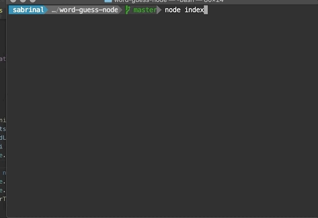
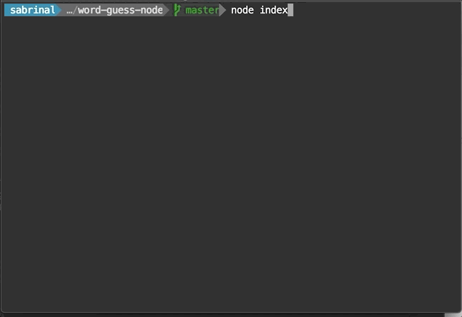
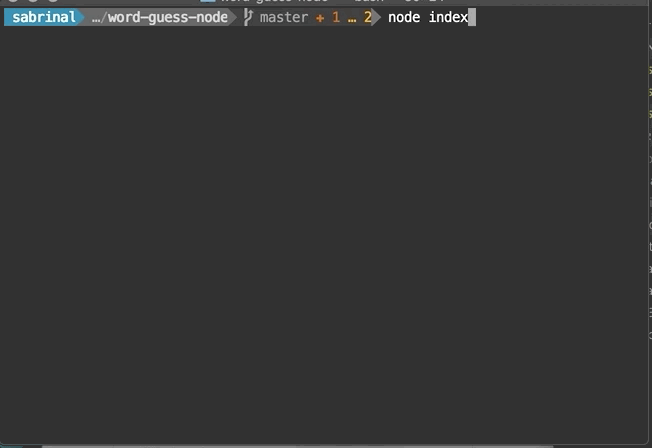

# word-guess-node
word guess game with constructors using nodeJS

## How to play
After cloning the project, run npm install to pull dependencies. 

Then Run `node index` 

Game flow shown as below. When you guessed correctly, it prompts "CORRECT" then check if the word is guessed, if so move on to the next word. For each word you have 12 guesses.

## Features

- input validation: each prompt will take one alphabetical charactor only
 

- Traking letters that are already guessed:
 

 - For each word you have 12 guesses, if the attempts run out, the game ends.
  

## API
API used to load the contries list:
[rest contries](https://restcountries.eu/)

